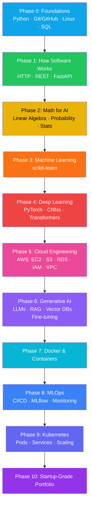

<div align="center">


# 👩‍💻 Palla Sivani Sahitya

**CS Undergraduate · Software Engineering & AI** | Python · FastAPI · React.js · SQL · JWT · LLM APIs

<a href="https://github.com/pallasahitya">
  
</a>

[](mailto:pallasahitya4@gmail.com)
[](https://github.com/pallasahitya)
[](#)
[](#)

<br>


</div>

> ⚠️ **Note to self before publishing:** swap the `#` placeholders above for your real LinkedIn and LeetCode profile URLs, and update the GitHub stats links below if your username differs.

---

<div align="center">

### 🧭 Quick Navigation

[👋 About](#-about-me) · [🛠️ Tech Stack](#️-tech-stack) · [🚀 Projects](#-featured-projects) · [💼 Experience](#-experience) · [🏆 Certifications](#-certifications--achievements) · [🗺️ 2026 Roadmap](#️-2026-aicloud-roadmap) · [📊 Stats](#-github-stats)

</div>

---

<div align="center">

</div>

## 👋 About Me

```python
class Sivani:
    def __init__(self):
        self.name = "Palla Sivani Sahitya"
        self.role = "CS Undergraduate | Software Engineering & AI"
        self.education = "B.Tech CSE, Pragati Engineering College, Surampalem (2024 - Present)"
        self.cgpa = "8.57 / 10"

        self.currently_building = [
            "🔐 Secure full-stack apps with FastAPI + React + JWT",
            "🤖 LLM-powered tools using the Groq API & prompt engineering",
            "📄 PDF-aware AI assistants (RAG-style document Q&A)",
        ]

        self.stack = {
            "languages": ["Python", "C++", "C", "JavaScript"],
            "frameworks": ["FastAPI", "React.js", "Pydantic", "Tailwind CSS", "Framer Motion"],
            "backend": ["REST APIs", "JWT Auth", "Swagger/OpenAPI", "Async Programming"],
            "data": ["SQL", "SQLite"],
            "ai_ml": ["Groq LLM API", "Prompt Engineering", "ML Fundamentals"],
            "tools": ["Linux", "Git", "GitHub", "Postman"],
            "core_cs": ["DSA", "OOP", "DBMS", "System Design"],
        }

        self.currently_learning = "AI + Cloud Engineering roadmap (Python → ML → DL → AWS → GenAI → MLOps)"
        self.fun_fact = "Solved 150+ LeetCode problems, one grind session at a time 🧩"

    def say_hi(self):
        return "Always happy to talk code, AI, or internships!"
```

---

<div align="center">

</div>

## 🛠️ Tech Stack

<div align="center">

<a href="https://skillicons.dev">
  
</a>

<br><br>

**Languages**


**Frameworks & Frontend**


**Backend, Data & Tools**


**AI / ML**


</div>

---

<div align="center">

</div>

## 🚀 Featured Projects

<!-- ─────────────────────────────────────────────
     Add a new project? Copy a row, fill in:
     Name · description · tech badges · demo · repo link
───────────────────────────────────────────────── -->

| Project | Description | Tech | Source |
|---|---|---|---|
| ✅ **TaskFlow — Full-Stack Task Manager** | Task management app with 11 REST endpoints, JWT auth, bcrypt password hashing, protected routes, and a raw-SQL SQLite schema for users & tasks. React frontend talks to FastAPI via Axios for full CRUD. |     | [Repo](https://github.com/pallasahitya/TaskFlow) |
| 🤖 **AI Study Assistant** | Context-aware study/coding assistant built on the Gemini 2.5 Flash API with prompt engineering, plus a PyMuPDF pipeline that lets it read uploaded PDFs and answer document-grounded questions. React + Tailwind + Framer Motion UI with markdown rendering, syntax-highlighted code, and chat/PDF state management. |     | [Repo](https://github.com/pallasahitya/ai-study-assistant) |

> 📌 More projects are on the way as I move through the roadmap below — resume analyzer, RAG chatbot, and an AI agent system are next up.

---

<div align="center">

</div>

## 💼 Experience

**Python Fullstack Developer Intern** — Industry Internship Program `Mar 2026`
- Developed React UI components integrated with FastAPI backend APIs, implementing form validation and database-driven CRUD operations.
- Contributed to full-stack application development by designing database schemas, building REST APIs, and implementing responsive frontend features.

**Google AIML Intern** — Industry Internship Program `Dec 2025`
- Trained and evaluated supervised machine learning models using data preprocessing, feature engineering, cross-validation, and classification metrics.
- Studied transformer architectures, attention mechanisms, and LLM inference workflows through hands-on implementation and experimentation.

---

<div align="center">

</div>

## 🏆 Certifications & Achievements


- 🧩 Solved **150+ LeetCode problems** — arrays, linked lists, trees, graphs, binary search, dynamic programming.
- 🛠️ Attended technical workshops on Web Development, Generative AI, Cloud Computing, and Artificial Intelligence.

---

<div align="center">

</div>

## 🗺️ 2026 AI/Cloud Roadmap

> My plan for going from full-stack developer → AI + Cloud engineer, one phase at a time. Each phase ends with real projects, not just theory.



<details>
<summary><b>🔍 Click to expand the full phase-by-phase breakdown</b></summary>

<br>

**Phase 0 — Build the Foundation**
- **Python:** variables, data types, functions, OOP, file handling, exception handling, modules, virtual environments → *Expense tracker, Student management system, File organizer*
- **Git & GitHub:** repositories, commits, branches, merges, pull requests — every project goes on GitHub
- **Linux:** navigation, permissions, processes, shell scripting (`ls`, `cd`, `mkdir`, `rm`, `grep`, `chmod`, `ps`, `kill`)
- **SQL:** `SELECT`, `WHERE`, `GROUP BY`, `JOIN`, indexes on PostgreSQL → *Student database system*

**Phase 1 — Learn How Software Actually Works**
- HTTP, REST APIs, JSON, authentication, backend fundamentals with **FastAPI**
- Architecture: `Frontend → API → Database`
- Projects: *Notes app, Task manager*

**Phase 2 — Mathematics for AI** *(in parallel)*
- Linear algebra: vectors, matrices, dot product
- Probability: conditional probability, Bayes' theorem
- Statistics: mean, variance, standard deviation

**Phase 3 — Machine Learning**
- Framework: **scikit-learn**
- Regression, classification, clustering, evaluation metrics
- Beginner: *House price prediction, Student marks prediction*
- Intermediate: *Spam classifier, Customer churn prediction*

**Phase 4 — Deep Learning**
- Framework: **PyTorch**
- Neural networks, backpropagation, CNNs, Transformers
- Projects: *Image classifier, Handwritten digit recognition*

**Phase 5 — Cloud Engineering (AWS)**
- Compute: EC2, Lambda · Storage: S3 · Database: RDS · Security: IAM · Networking: VPC
- Project: *Deploy a web application*

**Phase 6 — Generative AI**
- LLMs, embeddings, vector databases, RAG, fine-tuning basics
- Tools: Hugging Face, OpenAI Platform
- Projects: *PDF chatbot (upload → ask questions), AI Study Assistant, Research Assistant*

**Phase 7 — Docker & Containers**
- Images, containers, Docker Compose
- Project: *Containerize the AI chatbot*

**Phase 8 — MLOps**
- CI/CD, monitoring, model deployment, experiment tracking
- Tools: MLflow, GitHub Actions

**Phase 9 — Kubernetes**
- Pods, services, deployments, scaling
- Project: *Deploy AI services on a cluster*

**Phase 10 — Build a Startup-Grade Portfolio**
By graduation, aim for one solid project in each of:
- **AI Project:** Resume Analyzer
- **Cloud Project:** AWS-hosted application
- **LLM Project:** RAG chatbot
- **MLOps Project:** Automated deployment pipeline
- **Advanced Project:** AI agent system

</details>

---

<div align="center">

</div>

## 📊 GitHub Stats

<div align="center">


<br>


</div>

---

<div align="center">


<br>

### 🌟 *"Every phase completed is a project shipped, not just a topic checked off."*

<br>

### 🤝 Let's Connect

[](mailto:pallasahitya4@gmail.com)
[](https://github.com/pallasahitya)
[](#)

<br>


**⭐️ From [pallasahitya](https://github.com/pallasahitya) — Made with 💙 in Markdown**


</div>
